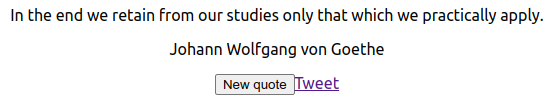

This project was bootstrapped with [Create React App](https://github.com/facebook/create-react-app) by running the 
following command from the parent folder:
```shell
npx create-react-app freecodecamp-frontend-quote --template typescript
```

# Random quote generator

A random quote generator for practicing React development,
based on the description and tests from [freecodecamp.org's frontend project: Build a Random Quote Machine](https://www.freecodecamp.org/learn/front-end-development-libraries/front-end-development-libraries-projects/build-a-random-quote-machine)\
Please visit https://kbrnsr.github.io/freecodecamp-frontend-quote
for a working example



## Setup

Assuming that all commands are run from project root.

Install the project by running this command from the project root:
```shell
npm install
```

Run the app in the development mode.\
Open [http://localhost:3000](http://localhost:3000) to view it in the browser.
```shell
npm start
```

Run tests by running:
```shell
npm test
```

The only real configuration you might need to do is changing `baseUrl` in
[src/constants.ts](src/constants.ts). It refers to a REST endpoint that should return a payload in the format:
```json
[
  {
    text: 'Genius is one percent inspiration and ninety-nine percent perspiration.',
    author: 'Thomas Edison',
  },
  {
    text: 'You can observe a lot just by watching.',
    author: 'Yogi Berra',
  }
]
```

Note that the payload should be in this format, if you need to change the endpoint URL then 
I would recommend transforming the payload in the handler.

## CI/CD

Not much to say here, see [.github/workflows/ci.yml](.github/workflows/ci.yml) for continuous integration and [.github/workflows/cd.yml](.github/workflows/cd.yml) for continuous deployment.

The CD process deploys to Github Pages

## Tech used

- [Node.js](https://nodejs.org/en/)
- [React](https://reactjs.org/)
- [Create React App](https://create-react-app.dev/)
- [Axios](https://axios-http.com/)
- [Jest](https://jestjs.io/)
- [React Testing Library](https://testing-library.com/docs/react-testing-library/intro/)
- [Mock Service Worker (MSW)](https://mswjs.io/)
- [ESlint](https://eslint.org/)
- [TypeScript ESLint](https://typescript-eslint.io/)

## Credits
- Kent C. Dodds for his blog post [Stop mocking fetch](https://kentcdodds.com/blog/stop-mocking-fetch) which introduced me to `MSW` and `react-testing-library`.
- SergeyWebPro for [providing a free endpoint for inspirational quotes](https://forum.freecodecamp.org/t/free-api-inspirational-quotes-json-with-code-examples/311373).
